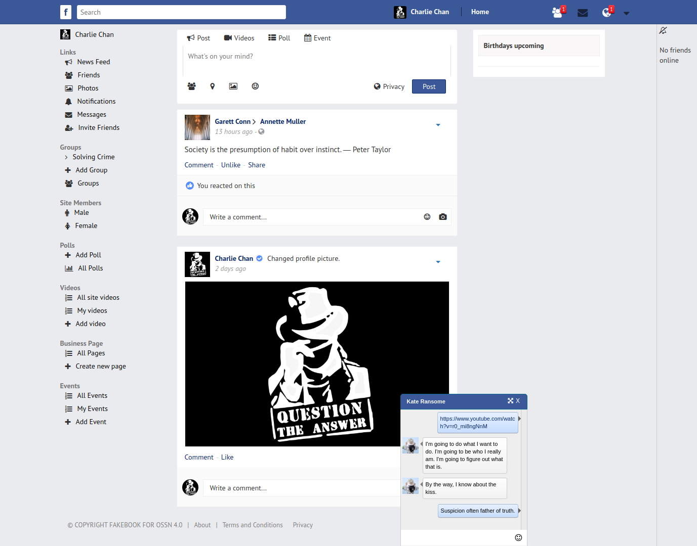

ossnfacebook
============

A Facebook-like theme  for OSSN 

Opensource-SocialNetwork also know as OSSN is a social networking software written in PHP. It allows you to make a social networking website, helps your members build social relationships with people who share similar professional or personal interests.

This project is a customised theme with similar colours as Facebook, and the repository is forked from an old project that has not been updated for years: https://github.com/sathish4fri/ossnfacebook

OSSN and the Fakebook theme are released under the GNU General Public License (GPL) Version 2

Installation
============

http://docs.opensource-socialnetwork.org/index.php/How_To_Install_Open_Source_Social_Network

In the "Themes" section of the Administrator Control Panel, just upload the zipped theme in theme manager and then enable the theme.

Any bugs or feature requests you can report through the Github issues manager for this repository: https://github.com/happyhiveworker/ossnfacebook
